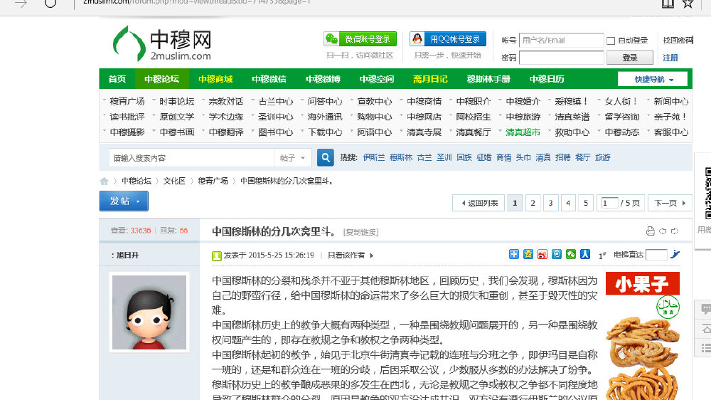

#中国穆斯林的几次窝里斗

* 转发者:[轻轻闲影](http://m.weibo.cn/u/3844773596)
* 08.05 20:13
* 信息来源：中穆网
* [原链接](http://weibo.com/ttarticle/p/show?id=2309404005206856700478)

`网友评论: 所以才有那句西北谚语：回回争教门，争来争去杀汉人，次次玩大了，官府处理了，有仇恨了，就滥杀周边无辜的其他民族，特别是汉族，破罐破摔。只看到自己最后被屠的悲惨，却不反思自己不考虑后果的盲动。一次次之后还不反省，到现在又开始盲目自大，仗着国家偏袒政策，把五做到六，到处拉仇恨，循环轮回`

`编者评:从几次教规之争可以看出,很多争斗是来源于阿拉伯地区引入的观念做法,如果伊斯兰能够完全中国化,拒绝受阿拉伯地区落后的观念做法引导,就不会有这么多的流血惨剧`

中国穆斯林的分裂和残杀并不亚于其他穆斯林地区，回顾历史，我们会发现，穆斯林因为自己的野蛮行径，给中国穆斯林的命运带来了多么巨大的损失和重创，甚至于毁灭性的灾难。

中国穆斯林历史上的教争大概有两种类型，一种是围绕教规问题展开的，另一种是围绕教权问题产生的，即存在教规之争和教权之争两种类型。

中国穆斯林起初的教争，始见于北京牛街清真寺记载的连班与分班之争，即伊玛目是自称一班的，还是和群众连在一班的分歧，后因采取公议，少数服从多数的办法解决了纷争。

穆斯林历史上的教争酿成恶果的多发生在西北，无论是教规之争或教权之争都不同程度地导致了穆斯林群众的分裂，原因是教争的双方没达成共识，双方没有遵行伊斯兰的公议原则来处理，而是让问题长期地存在下去以致产生新教派和子门宦，或上告统治者，把非对抗性矛盾激化成对抗性矛盾，把内部矛盾转化成敌我矛盾造成流血事件。

中国穆斯林历史上的教争第一种类型往往以宗教操守的一些细节枝末节问题为触发点，双方上升到信仰的高度来互相批评，互相控制，各自都宣传唯本派才是真正的伊斯兰教门，而别的派别则是外道，结果往往因一些小异酿成大祸，演成武斗，造成流血冲突，最终给反动统治阶级和民族内部的反动分子创造了挑拨离间和借此镇压及血洗的机会。第二种类型又是以宗教领袖继承权为核心的分化格局，最终形成越来越多的子门宦，也就是说，第一种类型大都在教派内产生，第二种类型大都在门宦内出现。

下面我们来分别说说它们的基本情况，首先我们先看看第一种类型，即围绕教规为触发点的教争。

西北穆斯林历史上围绕教规为触发点的教争起始于清乾隆十三年的“前开、后开”之争。

乾隆初，**河州回民中出现了马来迟从麦加朝觐带回来的在斋月里先开斋，后礼拜的遵行，结果引起了祖传先礼拜后开斋遵行的阿訇们的不满**，以致发展到“后开”者马应焕去上告官府，由清政府来出面，以前开后开同时存在“前开后开的各遵祖教”的处理方式才解决了这次教争。

西北穆斯林历史上的第二次教争发生在乾隆四十六年的青海循化地区。

教争的双方是马来迟创立的华寺门宦和马明心创立的哲合忍耶门宦，根由主要是宗教礼仪上的不同产生了矛盾，**如“哲合忍耶的贺麻路乎念经摇头，华寺门宦的韩哈知说他不是祖传老教的规矩，贺麻路乎又说韩哈知要的布施多，”结果造成流血事件**，给穆斯林内部带来了不可估量的损失。下面我们来简单叙述一下这次教争引起械斗造成的不利后果。

乾隆二十七年，“某户教民，兄属哲派，弟属华寺，其母逝世后兄要请哲派阿訇主持葬礼，弟坚持要华寺门宦阿訇主持葬礼，引起华寺不满，借故滋生事端，促成械斗，发生伤亡事件。”

乾隆三十八年九月，因华寺门宦的信徒韩个牙等二十家改遵哲合忍耶的问题，双方争斗，哲派1人被杀。十一月，哲派又杀死了华派的4人。四十五年九月，双方因葬礼仪式主张各异，而发生争斗，结果哲派1人被打伤，数日后死去。

乾隆四十六年间，在循化地区的华寺门宦和哲合忍耶门宦信教群众由教派纷争发展到群体械斗，招来清廷惨绝人寰的屠杀，人口锐减近半，十二工变成八工。在血的教训面前，挑起事端的宗教界人士没有留下半句让后代吸取教训的有关起因、经过和结局的记述。只在官方文案中见到：“其妻妾子女，其下稚孩即年未及岁，俱当概予骈株。”[《华东续录》第28卷、20页]。“首犯身樱寸磔，合家俱缘坐正法” [《华东续录》第28卷、20页]。“为了彻底肃清将贼匪经过之处及煽诱之处，实力搜缉，有形迹可疑者，多加殄戮” [《华东续录》第1207卷、48页]。当时撒拉民族尚剩人口和户数无从查考，遭镇压的哲合忍耶门宦人口原先约占撒拉族人口的一半，现被赶尽杀绝，连根铲除。除青壮年尽遭诛戮以外，妇女姑娘被清兵霸占为妻妾，老幼则充发到广西百色、云南普洱和新疆伊犁地区，还有少部分人害怕杀戮，逃亡安多藏区，为了活命而顺从了藏民的风俗习惯。青海果洛地区有个阿什姜部落，据当地老人们叙述，他们是很早以前从鸭泽（指循化）阿什姜地区避难来到这里的。而帮助官方杀戮本民族的另一派别的几个头人被请到兰州督署衙门大堂，钦差大人说：“你们帮朝廷出力消灭了造反的对方，现在朝廷要论功行赏，看你们要什么功名，说出来。”头人们茫然了，什么功名啊、赏赐啊的，不明白啥意思。经向侍立两旁的官员求救后，有人小声嘀咕：“趁这个机会给清真寺的屋顶扣个琉璃瓦吧？”钦差大人听了厉声回答：“屋顶扣琉璃瓦，皇帝宫殿才能用，民间草民不准扣。好，你们有这愿望，准许你们在清真寺屋脊扣一溜，屋顶中间扣一方块。”现循化白庄乡张尕村清真寺大殿的屋顶屋脊，还保留着这种扣屋脊一溜琉璃瓦的样式。钦差又问：“还要什么？”头人们又相互观望了一阵，有人低声嘀咕：“要八棱碌碡。”钦差问明是什么东西，觉得十分可笑，立即允准。要八棱碌碡的原因，是因为牲畜牵引碾场比六棱碌碡轻松，帮助清廷杀害自己同胞无数，追求目标却不过如此，当地的民族整体素质可见一斑了。

这次由教争转化的反清起义失败之后，清政府对伊斯兰教和信伊斯兰教的民族的政策有了一个很大的改变，更加采取了歧视压迫的“高压政策。”

西北穆斯林历史上的第三次教争是因争寺礼拜产生的。

咸丰八年，河州和化隆地区华寺的穆斯林去湟源经商的人不断增多，致使穆夫提门宦所建两座礼拜寺容纳不下当地的穆夫提礼拜人，因此引起了穆夫提教民的强烈不满，他们联合起来不准河州、化隆的穆斯林入寺，结果双方产生了争议，矛盾不断扩大导致“各处教民纷起效尤。”

西北穆斯林历史上的第四次教争是华寺门宦总约马桂源与穆夫提门宦的掌教冶承祖“因教派不同渐生嫌隙”互相攻讧引发的。

于此，“同治二年，马桂源率众将穆夫提门宦的教众‘诱至东关清真寺内，捆缚千余，杀于东郊外南壕沟’作为报复。”“教派之争一起的恶果，就是这样的残酷。”

西北穆斯林历史上的第五次教争是同治年间的“湖海之争”。

**北庄老人家认为在念“色米二拉乎立曼哈米代海”时，应念“代海”，胡门则认为念“代呼”，不能念“代海”。由于“代海”和“代呼”一音之别而争执不休，遂动起武器，使双方无辜群众多次流血死亡。**官司曾打到兰州府。知府大人问明原委，觉得十分可笑，来了个荒唐官判荒唐案：“双方别争了，争个‘代海’，‘代湖’吗？就‘代海’吧，海比湖大。”“代湖”的一派不服，煽动群众斗殴，死伤多人，又一次招来清廷的残酷镇压，使西北信仰伊斯兰教各民族血流成河，尸骨如山，面对这种惨景，连朝廷官员都看不过去 ：“臣此次督兵出省……绕越北山而回，途次所历，竟有求斗栗之汆，勺水之钦，束薪之炊，寸草之牧而不可得者，不仅居民无片瓦一椽之庇而已，……臣转战数省所未见之艰难情形”。“甘肃焚掠之惨，较陕省为甚，臣入境以来，窃见人烟稀少，田土荒芜，屋庐灰烬，几于赤地千里”。“循至于今，地方被祸既深，居民子遗，十无一二，田土荒芜，一片荆榛。饥馑之馀，人相隔食”[《杨勇悫公凑议》第5卷、11页，第4卷、51页，第10卷、2页]。原来安居乐业的穆斯林被屠夫左宗棠以剿办炒作的名义，残酷地强迫举家向外迁徙，有的迁到宁夏西海固地区，有的迁到青海化隆卡里岗地区，及麻什加沙连堡村，塔加村，叶什春村。原先居住在兰州到西宁湟水沿岸的回民也被强行迁移到偏僻的浅山地区，如平安县刍刍尔沟，拉树林等。一次栲勒村胡门教徒，把墙沟北庄门宦的四、五十户教徒先行洗杀，过了不久，北庄纠集众多教徒，对栲勒胡门教徒，在一夜之中进行了报复性的洗劫，死伤达百余人，当时双方互不相让，上告官府，想依靠各自在清政府的政治地位压倒对方。马占鳌怕扩大事态，引起祸乱，就以北庄马悟真和胡门马万有与他的私人关系出面调解，经多次周旋，才以“各干各事”劝其了事。

西北穆斯林历史上的第六次教争是同属华寺门宦的新老两派之间在光绪二十一年因缠“太丝达尔”的方法不同引起的。

**新派认为缠“太丝达尔”必须露尾才符合伊斯兰教义，否则就是“异端”行为，而老派则认为“太丝达尔”不需露尾，因为他们认为露尾是“异端”的做法，结果双方各持己见，争吵不休，于是，事态不断扩大，进而相互仇杀。**双方在古兹来村的一次械斗，就伤亡二、三十人。老派头人朝努日还鼓动手下人把两个新教阿訇围困在“张噶工”活活打死，并破腹抽肠，装上石头；又把一些捉到的“新教”派人，用非刑拷打，强迫剃掉胡子。这样教争又一次给清政府的道员找到了滥杀的机会，他们“一次就将老教十一人斩首示众，”老教不服，盲目发动起义，又惨遭镇压，结果造成几十万穆斯林群众死亡。

据记载：“……攻克大迟到隘，回酋坐困孤城，宿将声威，足寒贼胆，勇矣刚刚八(意好汉)之名实相符男妇老幼被杀者有数万人，闻之能不令人酸鼻？”[《甘宁青史略》第25卷、33页]。“二月董福祥遣何得彪等马步二千破之，贼窜水峡，追声之落水者无算，余窜青海草地，适天大雪，多冻馁死者”[《甘肃新通志》第47卷，《兵防志?戒事下》]。

陕甘总督陶模说：“臣查湟回自月初水峡窜出，共七、八万人……三月大雪封山，无处掠食，冻死、饿死，数以万计”。《陶勤肃公凑议》光绪二十二年六月折，新疆巡抚应祺：“据获贼供称，自西宁窜出时，大小男妇七、八万人，分为三股，沿途冻死饿死者尚重”。又说：“臣应祺将各起抚回，……发给账（赈）粮，暂资糊口……查有距‘英格可立’两站‘英气格沙河’沙土肥美，旱涝可收，乃于去冬派勇督民开渠放水，今春发给籽种，拨回二千余人前来耕种”。从上述事实可知，逃出去的七八万人，到达新疆收抚安置在罗尔淖尔的只剩几千人了。属海西州亚沙图地区有道沟叫瞎熊沟，也有人叫死人沟，这条沟里，到目前还能见到遍地是大小死人头骨，据说是从西宁逃出去的人到此地遇大雪而冻死饿死的尸骨。“已抚之回，无论良莠驾名逆目，悉与诛夷”《代陶制军致翁尚书书》。“多巴一带老弱孤寡之回，家搜户索，银钱粮草掳掠一空，无衣无食，虽生犹死” 《代陶制军致翁尚书书》。“董帅移节西宁，抵隙蹈暇，肆行杀戮，所部弁勇，任意淫掳，惨不忍言”《代周文齐廉访上张子青相国》。此役清廷令董福祥统一节制甘湘各军，令部将张成基，何得彪进军西宁。这时西宁东关的回民已接受安抚。可是何得彪等求功心切，对安抚的人民不问青红皂白，以发给生活费用的名义诱骗进东关大寺，然后由兵勇一个个捆缚至东稍门城墙下斩首处死，一时血流成河（故留名汩水咚巷道）。北关寺所在地当时是一片水洼地，这里不知杀了多少人，前几年北关寺修建学房，施工人员挖地基时曾挖出埋在表土底下的大片大片的殷红血块。湟中多巴城攻破后，清军进行了肆无忌惮的抢劫，整个多巴地区变成了一片鬼哭狼嚎之地，老百姓家里抢劫一空，一粒可以充饥的粮食也不给留下。并以发赈济粮为名，将收抚的百姓骗进多巴城全部斩首。这种残忍的做法，后来老百姓叫“多巴出行”。

待事态平息后，董福祥运用清廷“以回治回”的惯用手法，令马安良、马海宴、马福禄和马福祥在循化、化隆、民和地区处理“善后”名义继续杀戳青壮年，并向各乡各村摊派该杀的人头。马安良、马海宴在循化、化隆把砍下的头颅派骡夫驮往兰州；民和的马福禄、马福祥派骡夫驮运，一时派不了那么多骡子，便将头颅砍下后两个耳朵（顶一个人头）割下来送往兰州交差。这次事变，回民、撒拉族再一次蒙受了一场大浩劫，死于清军屠刀下的不算，有多人先后逃往藏区，成了藏民。《代陶制军致何建威》书中说：“河州西宁一带，萧条千里，被难灾民不下百十万……屠杀焚掠之惨，慌墟焦土，片瓦均无。”《致刘伯泉》书中言：“西宁则回民伤亡之数及逸出关外冻死饿死战死者，不下数十万人”。这其中不包括循化、隆化、民和为办“善后”向兰州交的人头。

西北穆斯林历史上的第七次教争是围绕伊赫瓦尼的“遵经革俗”运动产生的。

**清光绪十四年，马果园去麦加朝觐，拜“海里勺巴氏”为师，1894年他学成归国联合马云山等十大阿訇宣传伊赫瓦尼主张，倡导“遵经行教”，公开反对信仰门宦，因此遭到各门宦的强烈反对和攻击。继此，河州四方伊赫瓦尼和其他教派门宦之问，辩经论道，打架斗殴，不断发展。**

民国十二年，马果园在马麟的支持下，派尕阿訇任循化街子工总寺教长，强迫群众改信伊赫瓦尼，但少数人依从多数人反对，当反对者以死抗拒时，马麟随派军队驻到循化，并给伊赫瓦尼教徒发了枪，反对伊赫瓦尼的各派门宦不服，便派韩主麻等人求救于甘肃临夏大河家马国良。在马麟和马国良的各自支持一派的情况下，双发械斗达三个月之久，死伤群众六十余人，其中死亡二十八人，烧毁房屋数十间。

公元1940年，马步青命令在东乡汪百户集上修建一个伊赫瓦尼总寺，并令将汪百户“胡门门宦”修建的清真寺拆掉。“胡门教众听到后非常生气”，部分人在腊八阿訇的预谋下，准备将前来执行拆寺任务的临夏专员兼保安司令马维良杀害，六月二十八日，当马维良等人进入清真寺礼拜叩头时，他们同时动手，用刀刺死了马维良及随从马百克、马大哈知。

马维良被刺后，汪百户胡门信徒马万良、赵他回、马忠福以及马有成、苏海老三投案被判处死刑，同时潜逃外地的腊八阿訇亦被捕处决，事后马步芳又派兵屠杀汪百户数十人，被害群众达一百五十余人。

总之，西北地区在伊赫瓦尼兴起后，由于采取了强硬措施，教争也使不少穆斯林的生命丢失，这也是教训。

中国穆斯林，自清朝以来，对外没有发展，却在一次次教争内讧中减少人口，首先教争使双方的信徒丧失了生命，财富房屋被烧毁，其次由教争引发的数十次盲目起义被满清政府血洗镇压，使千千万万的信徒群众丧失了生命。

西北穆斯林历史上的第八次教争是由一次“整那则”引发的。

**光绪二十四年，北庄门宦站“整那则”,一派主张脱鞋，一派主张不脱鞋，遂发生纠纷，北庄门宦的“木勒提”敏永录为了排解纠纷，说“最好是脱，但不脱鞋也不违犯教规”，而北庄门宦的老教规却主张脱鞋，于是争执愈演愈烈。**马启西见此情况，就对敏永录说：“教规只是一条，对与不对只有一个，不能瞒哄蔽阴凉，你是‘木勒提’应当肯定对与不对。”敏永录不接受，双方产生恶感，以致失和，从此马启西便从北庄门宦脱离了出来创立西道堂。

马启西的西道堂以刘智的《天方性理》等教材作为宣传伊斯兰教义的依据，因此一开始就遭到旧城北庄和华寺等门宦阿訇的反对，他们攻击“马启西学了邪书邪法，传授的是邪教”。常拉北庄开学阿訇丁哈知还宣布：“凡是吃马启西家中的饭，或让马启西宰牲的人，都是外道，要重新入教”。于是马启西一时陷入孤立。

光绪二十九年，华寺教徒敏含章在军阀马安良的支持下联合敏仲元等发布以“夜聚晓散，数党结盟，倡导立异，惑乱人心”等罪名，将马启西密告于兰州五大宪。同时又与洮州厅曾麟绶相互勾结，自草布告数张，派外甥王尕喜、妻弟马三七送给曾麟绶以洮州厅的名义出示于街头攻击马启西。

光绪三十年古历二月一日，马启西和他的教生集资在西风山下修建了一座清真寺，敏含章又授意敏仲元等纠集多人，准备寻衅拆寺，结果引起清政府的重视，派兵前来弹压，一场紧张的械斗才未发生。

光绪三十一年古历二月间，马启西的教生去礼拜寺举行“聚礼”，旧城上寺的十大乡老和教长又来阻扰，结果双方在西河滩发生争执和斗殴，打伤马启西的教徒丁全德之父和马锡麟等人，并纵火烧毁了庄稼。

总之，甘肃旧城的穆斯林，因那次“者那则”产生分歧以来，斗争屡屡发生，以致矛盾发展到一方想执另一方于死地，但是这次教争的起因又是教门上的枝节，这就不得不令我们深思。

西北穆斯林历史上的第九次教争，是在伊赫瓦尼内部兴起。

**1936年，伊赫瓦尼阿訇马得宝、马正清前往麦加朝觐，在礼拜中跟随瓦哈比派的领拜伊玛姆抬手三次，认为礼拜中的三次抬手是遵行前三辈的干办，因此回国后就照此行事，兴起了赛莱菲耶运动，并因而被人蔑称为“三抬”，他们把留垂肩长发和举行宗教活动时披戴类似阿拉伯人的头巾作为圣行遵守，因此遭到各方势力的反对，一些伊赫瓦尼教徒斥责他们为“异端”、“外道”和“邪教”，于是两方互相诋毁，大肆攻击。**直到现在，仍然有极端者在宣扬“赛莱菲耶是外道”的谬论，他们在朝觐的时候不跟随麦加伊玛目礼拜，他们说麦加的伊玛目为“万哈比耶”，而“万哈比耶”是卡菲尔，因此跟随他们的礼拜不成。

前面我们用扫描式的方法来分析了中国穆斯林历史上由于教义、礼俗、遵行的不同而引起的部分教争情况，给读者得出了一个问题：中国穆斯林历史上的所谓的教争，起初并没有什么大的原则冲突，只是双方往往把一些人为制定的礼仪小节上升到信仰的高度来批判酿成的结果。双方都宣称自己才是真正的伊斯兰教门，而对立的一方则是“邪教”、“异端”、“外道”，多数改革者不是从根本上来探讨中国伊斯兰传播的前途，而是在一些枝节上搞批判，搞武斗，给反动的统治者各个击破或以回制回创造了可趋之举。

下面我们再来看看中国穆斯林历史上出现的第二种类型的教争即教权之争的情况。

开篇我们已经说过，中国穆斯林历史上的教权之争大都发生在门宦制度内，现在我们先来看看哲合忍耶门宦的教争情况。

创建于乾隆九年的哲合忍耶，原本是以反对门宦制度的形式出现的，但到第四辈掌门人马以德时，却有违创始人马明心“传贤不传子”的初衷，走上了子孙承袭制，因此也就无可避免地要发生教权之争的厄运走向分裂，最终人为地削弱了自身的力量。

哲合忍耶门宦内部的教权之争始于清末民初的马元章时期。清同治十年五月十三日，马化龙被左宗棠凌迟处死，哲合忍耶的教权继承问题发生了争执，说法也不一样，后来的北山派说，马化龙临危时，将传教的“口唤”交由秦安莲花城洼上马阿訇，令其将“口唤”传给马明心的后代接替。马从金积化装逃出，避居张家川，后来设法将传教“口唤”和衣服交给了马元章，所以马元章继承了教权，后来的南川派说，马化龙生前遗言，教权由其长孙马进城继承，但进城被阉割后发配河南开封清吏温某家中为奴，无法行使教权。当时大多数教徒认为，马化龙一家惨死，才换来了他们的生存，故承认马进城是教主。

哲合忍耶门宦在马进城在世时，由于当时他被满清政府押在开封，没有机会行使教权，因此他与马元章的教权之争只停留在教徒的思想认识上，在实际生活中没有真正的教争，即马元章和马进城没有实际的教权之争的现象，当时一切大小事基本上由马元章主持，真正的教争只是在马进城的弟弟马进西被马元章营救出来后才在马元章和马进西之间发生，门宦也才分成以马化龙的孙子马进西为首的“青川派”和以马明心的四世孙马元章为首的“北山派”。

光绪初年，马元章避开满清政府的追捕，改名换姓从云南逃到张家川，得知马化龙的孙子马进西被清政府捕押在西安，便和同治年间回民起义失败后投降清廷被封为武翼部尉的李得仓密谋，趁马进西被清政府解往内务部阉割为奴途经山西的时候，杀了解差，把马进西救出潜伏送往张家川。

后来他们又把被清政府流放到昌平的马化龙之妾白氏及被清政府流放到西吉沙沟和张家川恭门镇的马化龙的两个亲侄女救出迎送回张家川，并经白氏的同意和媒约撮合娶三房马化龙之次女与马化龙结成亲缘关系。

这样教徒就以下述理由尊他为教主：一、他是马明心的后代，二、祖先对哲派有贡献，为哲派被清廷杀害。三、马化龙后裔的脱险，他出了大力。四、他和他的兄弟马元超都是马化龙的女婿。但是当马进西被营救出来后，教徒也同样承认他是哲派的当然教主，理由是他是马化龙的后代，祖先对哲派有功绩，为哲派被清政府杀害。

一九一一年冬，辛亥革命成功，马元章在庆祝清廷灭亡，共和成立之时宣布继任第七辈教主，但马进西却不以为然，公开和他争夺教权，这样就使哲合忍耶分化成了两派即前面所说的以马元章为首的“北山派”和以马进西为首的“青川派”。哲合忍耶的“北山派”在马元章遇难后，又分裂成了两派，即“北山”和“沙沟”两派。

民国九年（公元一九二0年）古历十一月初八日，甘肃发生大地震，马元章在这次地震时遭遇逝世。其弟马元超以和马化龙遗体安葬一处为由，将马元章遗体搬葬于张家川宣化岗，并说马元章生前并未提过他死后由其子马震武继任教权的话，于是拒绝将张家川宣化岗的实权交给马元章之子马震武，自己占据了最富有吸引力的马化龙、马元章拱北——宣化岗，从此“北山派”内部失和，分为以马元超为首的“北山”和以马震武为首的“沙沟”两派。

哲合忍耶，在教主没有“子孙承袭”时，内部没有大的纷争，教权也在和平的气氛下更替，信徒基本上是以统一体的形式存在和发展的，但是一当教主走上“子孙承袭”后，纷争也就出现了。

历史上，自从穆斯林把伊斯兰的政教管理权由穆圣及四大哈里发时期的民主议会制改变成子孙世袭制后，分裂的恶果就越来越明显了，因为这样一来穆斯林上层为了争夺教权，一个完整的身体不是被分割成越来越小的板块，就是在内斗中互伤。这种现象在很多门宦中都存在，华寺门宦在第七辈教主后就分裂为二派，马永琳一派被称为老派，他斥责其侄马如彪所传的是新教，而马如彪又宣称自己领了传教“口唤”，另立门户，于是两派分庭抗礼，斗争时有发生，光绪十三年，循化华寺新派头人韩老四积极推行新派，受到老派韩如勒的抵制，两派各树一帜，互不相让，几乎闹出残杀案，光绪十九年，韩五十三和新派首领韩七十因“太丝达勒”头巾的形式问题发生争执，韩如勒乘机扩大事态，率领老派抢夺烧毁新派财物，演成武斗，双方伤亡数十人，光绪二十年循化华寺门宦中新派阿訇韩母撒和老派阿訇朝如勒又因讲经发生争执，引起械斗，老派人多势众，放火烧了新派的房屋，新派遂向循化厅、西宁府上诉，河州总兵汤彦和认为是华寺内部相争，就派华寺的头面人物马永瑞（马如彪的父亲）和马永琳（老派头人）兄弟两人到循化调解处理，结果，马永琳又鼓动韩如勒打死两个新阿訇，破腹抽肠，装上石头，竭力把事态扩大，于是激起新派愤怒，到兰州总督府上告马永琳，总督杨昌睿派西宁府陈嘉绩和道员徐锡祺与翰洪泉前往循化查办，陈、徐一到循化，就关闭城门，不问青红皂白就捕杀了老派十一人，枭首城头，于是老派群众一哄而起，与光绪二十一年古历三月初八围攻循化城。再次发动起义，但这次起义后，发动起义的首领马永琳和马永瑞兄弟在诱降后首先被杀，紧接着参加这次起义的大小首领一百三十七人及其部分家属也被杀，后来马安良又在四乡八坊屠杀了回民群众约五百余人，在西宁、循化又屠杀了两千余人，从此华寺门宦一蹶不振。

在穆夫提门宦内，第四辈教主哎布都力妥法勒的两个儿子马金焕和马玉焕也是为了因争夺教主继承权发生分裂，各立门户。乾隆初年，马金焕的父亲哎布都力妥法勒被临洮汉民乡绅以“邪教”告到官府被捕入狱，被押三年多出狱后不久就辞世，于是兄弟两人在一些上层的挑动上为争夺教权互不相让，长子马金焕认为自己是长子，是当然的继承人，次子马玉焕认为自己随父下狱三年多，有侍父亲的功劳，教主一职应由他继承，经过激烈的争夺，仍按“嫡系继承”的老规矩由长子马金焕继承了教主，掌握了道堂的教权和财权，并正式接管了穆夫提传教的“八件宝物”。其弟马玉焕及其追随者不服，后来迁居临夏八坊，各立门户传教形成了临洮门宦。

创建于河州东乡族中最大的一只门宦——北庄门宦，也是当第三辈教务实际掌权人马悟真逝世后，原创始人马葆真的五个穆勒师德，为了获取教务继承权，各立门户，自成一派，一支为苏池门宦，二支为达子沟拱北，三支称“小扬门”，四支称“妥叶老人家”，五支为井沟门宦。

创建于宁夏同心的洪门门宦在1936年后，也分为同心和海原两支。

创建于临夏崖头的门宦在1920年后，也分为了两派，即崖头门宦和高赵家门宦。

中国穆斯林历史上的教争，无论是教规之争或教权之争都是发生在停止向非穆斯林传播伊斯兰教这一背景之下，这就是它最大的局限，这就使得教争频繁发生，精力旺盛的穆斯林们不知道传教，于是纷纷将精力消耗在内讧之中，在宗教内部争夺信徒，挑起一场场赔血本的窝里斗。

教规之争不是去谋求发展，而是以己之见控对方为“异端”，这就把内部矛盾转化成了敌我矛盾，把学术问题升级为政治问题，给统治者创造了可趁机镇压的机会。

教权之争也不是去寻求发展，而是因宗教上层的利益争夺把穆斯林社会分割成越来越小的互相对立的几小块，结果是渔人得利。

信息来源中穆网：  http://www.2muslim.com/forum.php?mod=viewthread&tid=714735&page=1
